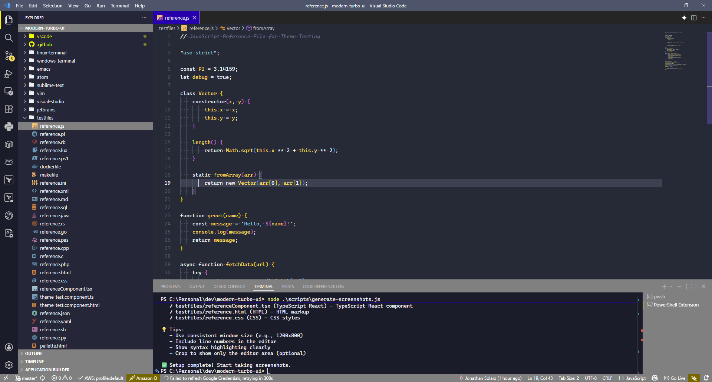
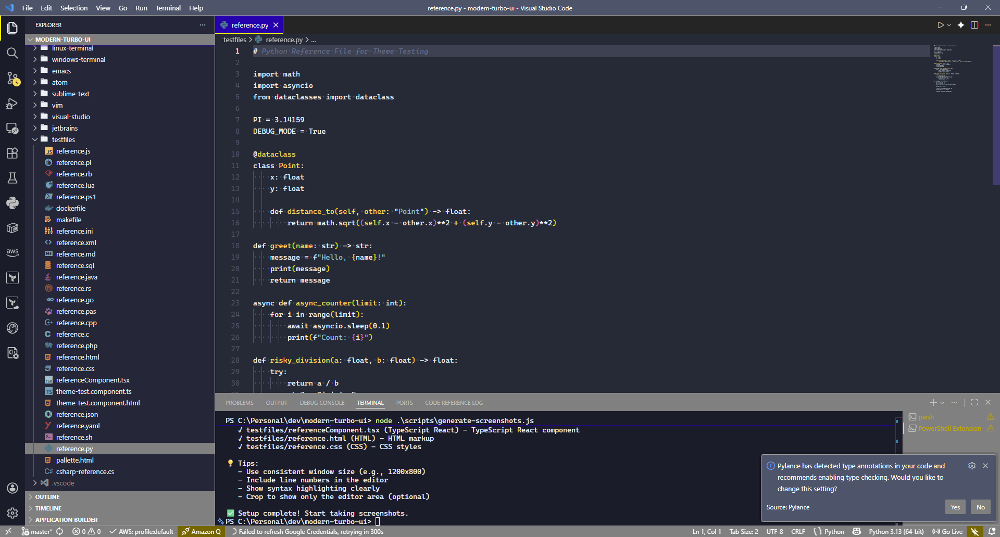
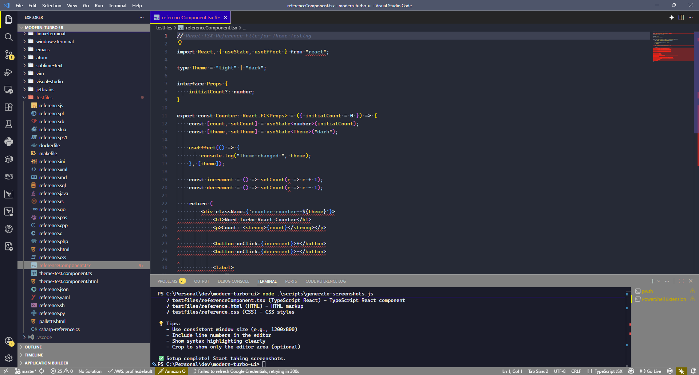
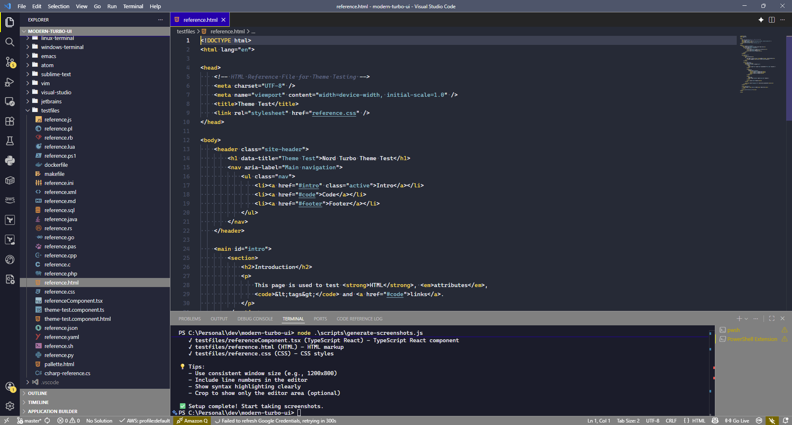
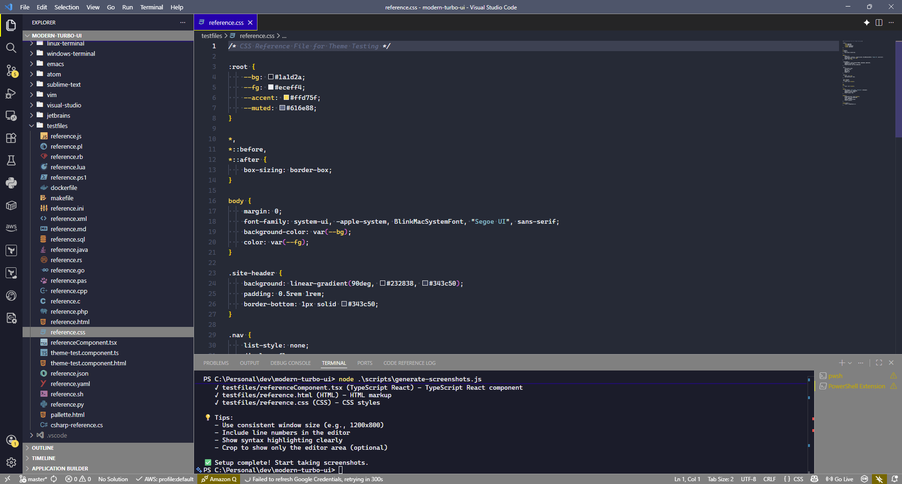

# Modern Turbo Pascal UI Themes

A collection of color themes inspired by Borland Turbo Pascal, available for multiple IDEs and terminals. Features both the original Borland Turbo Pascal color scheme and a modern Nord-inspired variant. High contrast, readable, and perfect for long coding sessions.

## 🎨 Theme Variants

### Nord Turbo Pascal Modern
A modern take on Turbo Pascal with Nord color palette influences. Features:
- Dark navy background with Nord accents
- High contrast for readability
- Softened colors for reduced eye strain
- Universal token colors across languages

**VS Code:** extended design notes for Turbo Pascal Modern (workbench keys, panel/debug UI, tabs) live in [docs/turbo-pascal-modern-vs-code.md](docs/turbo-pascal-modern-vs-code.md).

#### Screenshots

<details>
<summary>Click to view screenshots</summary>

##### JavaScript


##### Python


##### Pascal


##### TypeScript React


##### HTML


##### CSS


</details>

### Borland Turbo Pascal Original
Authentic recreation of the classic Borland Turbo Pascal IDE colors:
- Classic dark blue background (#0000AA)
- Bright syntax highlighting (white keywords, cyan strings, green comments)
- Original Turbo Pascal 7.0 aesthetic
- High contrast for nostalgic coding experience

#### Screenshots

<details>
<summary>Click to view screenshots</summary>

##### JavaScript


##### Python


##### Pascal


##### TypeScript React


##### HTML


##### CSS


</details>

> **Note**: Screenshots are generated from test files in the `testfiles/` directory. To generate your own screenshots, see [scripts/README.md](scripts/README.md) for instructions.

## 📁 Repository Structure

```
modern-turbo-ui/
├── vscode/              # Visual Studio Code extension
├── jetbrains/           # IntelliJ IDEA, WebStorm, etc.
├── visual-studio/       # Visual Studio themes
├── vim/                 # Vim color schemes
├── sublime-text/        # Sublime Text themes
├── atom/                # Atom editor themes
├── emacs/               # Emacs themes
├── linux-terminal/      # Linux terminal themes
├── windows-terminal/    # Windows Terminal themes
└── testfiles/           # Test files for theme validation
```

## 🚀 Installation

### Visual Studio Code

1. Open VS Code
2. Go to Extensions (Ctrl+Shift+X)
3. Search for "Modern Turbo Pascal UI"
4. Click Install

Or install manually:
```bash
cd vscode
npm install -g vsce
vsce package
code --install-extension *.vsix
```

### JetBrains IDEs (IntelliJ IDEA, WebStorm, PyCharm, etc.)

1. Open your JetBrains IDE
2. Go to `File` → `Settings` → `Editor` → `Color Scheme`
3. Click the gear icon → `Import Scheme...`
4. Select the `.icls` file from the `jetbrains/` folder
5. Choose either:
   - `Nord-Turbo-Pascal-Modern.icls`
   - `Borland-Turbo-Pascal-Original.icls`

### Visual Studio

1. Open Visual Studio
2. Go to `Tools` → `Import and Export Settings...`
3. Select `Import selected environment settings`
4. Browse to the `.vssettings` file in the `visual-studio/` folder
5. Choose either:
   - `Nord-Turbo-Pascal-Modern.vssettings`
   - `Borland-Turbo-Pascal-Original.vssettings`

### Vim

1. Copy the theme file to your vim colors directory:
```bash
mkdir -p ~/.vim/colors
cp vim/*.vim ~/.vim/colors/
```

2. Add to your `~/.vimrc`:
```vim
colorscheme nord-turbo-pascal-modern
" or
colorscheme borland-turbo-pascal-original
```

### Sublime Text

1. Open Sublime Text
2. Go to `Preferences` → `Browse Packages...`
3. Navigate to `User` folder
4. Copy the `.tmTheme` file from `sublime-text/` folder
5. Go to `Preferences` → `Color Scheme` → `User` → Select your theme

### Atom

1. Copy the theme JSON file to Atom's themes directory:
```bash
# macOS
cp atom/*.json ~/.atom/packages/

# Linux
cp atom/*.json ~/.atom/packages/

# Windows
cp atom/*.json %USERPROFILE%\.atom\packages\
```

2. Restart Atom and select the theme from Settings → Themes

### Emacs

1. Copy the theme file to your Emacs directory:
```bash
mkdir -p ~/.emacs.d/themes
cp emacs/*.el ~/.emacs.d/themes/
```

2. Add to your `~/.emacs` or `~/.emacs.d/init.el`:
```elisp
(add-to-list 'custom-theme-load-path "~/.emacs.d/themes")
(load-theme 'nord-turbo-pascal-modern t)
; or
(load-theme 'borland-turbo-pascal-original t)
```

### Linux Terminal

#### Shell Script Method
Add to your `~/.bashrc` or `~/.zshrc`:
```bash
source /path/to/linux-terminal/nord-turbo-pascal-modern.sh
```

#### Xresources Method (for X11 terminals)
```bash
xrdb -merge /path/to/linux-terminal/nord-turbo-pascal-modern.Xresources
```

See `linux-terminal/README.md` for terminal-specific instructions (Alacritty, Terminator, GNOME Terminal, etc.)

### Windows Terminal

1. Open Windows Terminal
2. Press `Ctrl+,` to open Settings
3. Click "Open JSON file"
4. Add the theme JSON to the `schemes` array in your `profiles` section
5. Set `"colorScheme": "Nord Turbo Pascal Modern"` in your profile

See `windows-terminal/README.md` for detailed instructions.

## 🎯 Color Palette

### Nord Turbo Pascal Modern

| Element | Color | Hex |
|---------|-------|-----|
| Background | Dark Navy | `#252b36` |
| Foreground | Light Grey | `#ECEFF4` |
| Keywords | White | `#ECEFF4` |
| Identifiers | Yellow | `#FFD75F` |
| Strings | Cyan | `#88C0D0` |
| Comments | Grey | `#616E88` |
| Numbers | Light Blue | `#E5F6FF` |
| Selection | Blue | `#2E4A7F` |

### Borland Turbo Pascal Original

| Element | Color | Hex |
|---------|-------|-----|
| Background | Dark Blue | `#0000AA` |
| Foreground | Light Grey | `#AAAAAA` |
| Keywords | White | `#FFFFFF` |
| Identifiers | Light Grey | `#AAAAAA` |
| Strings | Cyan | `#00FFFF` |
| Comments | Green | `#00FF00` |
| Numbers | Magenta | `#FF00FF` |
| Operators | Yellow | `#FFFF00` |
| Selection | Blue-Grey | `#5555AA` |

## 🧪 Testing

Test files are included in the `testfiles/` directory covering various programming languages to validate theme rendering across different syntaxes.

### Generating Screenshots

To generate screenshots for the theme showcase:

1. **Quick Start**: Run the helper script:
   ```powershell
   # Windows PowerShell
   .\scripts\open-for-screenshots.ps1
   ```
   ```bash
   # Linux/Mac
   node scripts/generate-screenshots.js
   ```

2. **Manual Steps**:
   - Open VS Code
   - Select theme: `Ctrl+Shift+P` → "Color Theme" → Choose theme
   - Open test files from `testfiles/` directory
   - Take screenshots and save to `screenshots/` directory
   - Use naming: `nord-modern-{filename}.png` or `borland-original-{filename}.png`

See [scripts/README.md](scripts/README.md) for detailed instructions.

## 📝 License

MIT License - see [LICENSE](LICENSE) for details. Documentation is licensed under Creative Commons BY-NC-ND 4.0 - see [CONTENT-LICENSE.md](CONTENT-LICENSE.md) for details.

## 🤝 Contributing

Contributions are welcome! Please see [CONTRIBUTING.md](CONTRIBUTING.md) for guidelines.

- [GitHub Repository](https://github.com/jsolarz/Modern-Turbo-UI-Color-Scheme)
- [Report Issues](https://github.com/jsolarz/Modern-Turbo-UI-Color-Scheme/issues)
- [VS Code Extension](https://marketplace.visualstudio.com/items?itemName=jonathansolarz.modern-turbo-pascal-ui)

## 📚 References

- [Nord Theme](https://www.nordtheme.com/)
- [Borland Turbo Pascal](https://en.wikipedia.org/wiki/Turbo_Pascal)
- [VS Code Theme Documentation](https://code.visualstudio.com/api/extension-guides/color-theme)

## 🙏 Acknowledgments

- Inspired by the classic Borland Turbo Pascal IDE
- Color palette influenced by the Nord theme project
- Community feedback and contributions

---

**Enjoy coding with a touch of nostalgia! 🚀**
