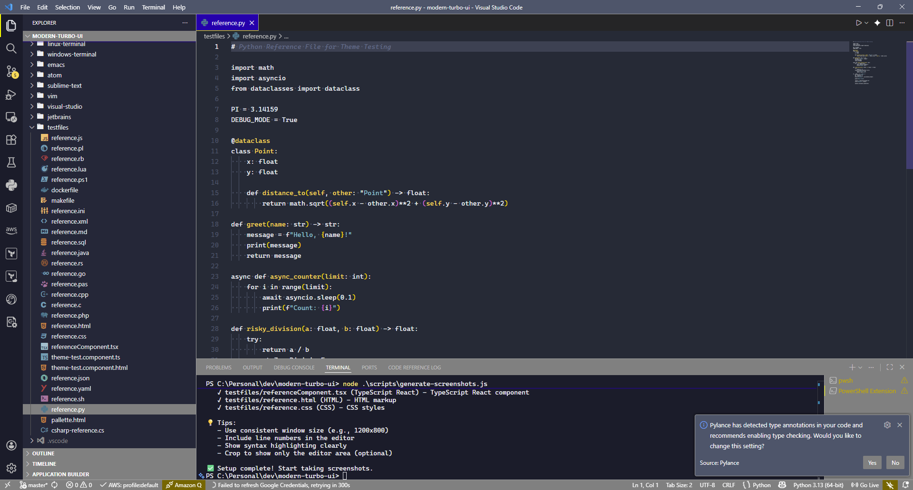
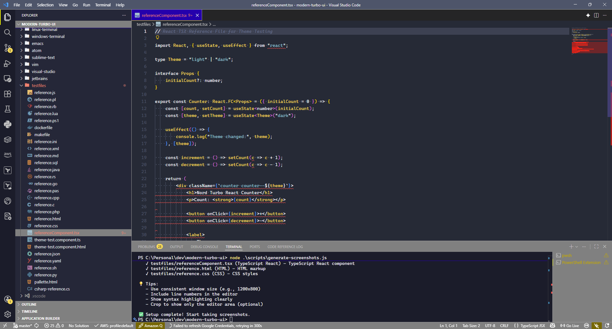
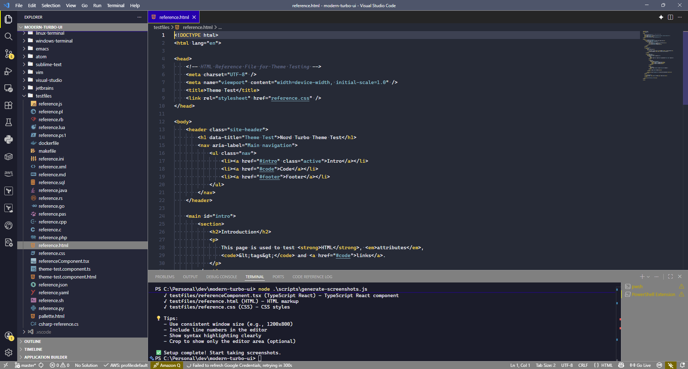

# Modern Turbo Pascal UI

Nostalgic color themes for VS Code inspired by the classic Borland Turbo Pascal IDE. Features both the authentic original color scheme and a modern Nord-inspired variant.

## 🎨 Themes

### Nord Turbo Pascal Modern
A refined take on the classic Turbo Pascal aesthetic with Nord color palette influences:
- Dark navy background with high contrast
- Softened colors for reduced eye strain
- Universal token colors across all languages
- Perfect for long coding sessions

#### Screenshots

<details>
<summary>Click to view screenshots</summary>

##### JavaScript


##### Python


##### C#


##### TypeScript React


##### HTML


##### CSS


</details>

### Borland Turbo Pascal Original
Authentic recreation of the classic Borland Turbo Pascal 7.0 IDE:
- Classic dark blue background (#0000AA)
- Bright white keywords
- Cyan strings and green comments
- High contrast for maximum readability
- Pure nostalgia for Turbo Pascal veterans

#### Screenshots

<details>
<summary>Click to view screenshots</summary>

##### JavaScript


##### Python


##### Pascal


##### TypeScript React


##### HTML


##### CSS


</details>


## 🚀 Installation

1. Open VS Code
2. Go to Extensions (Ctrl+Shift+X / Cmd+Shift+X)
3. Search for "Modern Turbo Pascal UI"
4. Click Install

Or install via command line:
```bash
code --install-extension jonathansolarz.modern-turbo-pascal-ui
```

## 📖 Usage

1. Open Command Palette (Ctrl+Shift+P / Cmd+Shift+P)
2. Type "Preferences: Color Theme"
3. Select either:
   - **Nord Turbo Pascal Modern**
   - **Borland Turbo Pascal Original**

## 🎯 Features

- **Two Theme Variants**: Choose between modern refinement or authentic classic
- **High Contrast**: Designed for readability and reduced eye strain
- **Universal Support**: Works with all programming languages
- **Consistent Colors**: Same color palette across all syntax elements
- **Professional Appearance**: Perfect for screenshots and presentations

## 🎨 Color Palette

### Nord Turbo Pascal Modern
- Background: `#252b36` (Dark Navy)
- Keywords: `#ECEFF4` (White)
- Identifiers: `#FFD75F` (Yellow)
- Strings: `#88C0D0` (Cyan)
- Comments: `#616E88` (Grey)
- Numbers: `#E5F6FF` (Light Blue)

### Borland Turbo Pascal Original
- Background: `#0000AA` (Dark Blue)
- Keywords: `#FFFFFF` (White)
- Identifiers: `#AAAAAA` (Light Grey)
- Strings: `#00FFFF` (Cyan)
- Comments: `#00FF00` (Green)
- Numbers: `#FF00FF` (Magenta)

## 📝 Requirements

- VS Code 1.60.0 or higher

## 🔗 Links

- [GitHub Repository](https://github.com/jsolarz/Modern-Turbo-UI-Color-Scheme)
- [Report Issues](https://github.com/jsolarz/Modern-Turbo-UI-Color-Scheme/issues)
- [Other IDE Themes](https://github.com/jsolarz/Modern-Turbo-UI-Color-Scheme) (JetBrains, Vim, Sublime Text, etc.)

## 📄 License

MIT License - see [LICENSE](https://github.com/jsolarz/Modern-Turbo-UI-Color-Scheme/blob/main/LICENSE) for details.

## 🙏 Acknowledgments

- Inspired by the classic Borland Turbo Pascal IDE
- Color palette influenced by the Nord theme project
- Community feedback and contributions

---

**Enjoy coding with a touch of nostalgia! 🚀**
